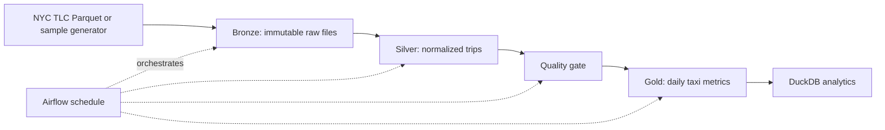

# NYC Taxi Lakehouse

A production-style, local-first data platform for turning NYC taxi trip records into trusted analytics datasets. The project demonstrates incremental ingestion, medallion architecture, dimensional modeling, data-quality checks, reproducible tests, and CI/CD without requiring a paid cloud account.

## Why this project matters

Transportation data is high-volume, time-partitioned, and prone to late or malformed records. This pipeline treats the raw source as an append-only landing zone, creates deterministic silver transformations, and publishes a gold daily-metrics mart for analytics consumers.

## Architecture



## Data layers

| Layer | Purpose | Output |
| --- | --- | --- |
| Bronze | Preserve the source and ingestion metadata | `data/bronze/*.parquet` |
| Silver | Normalize columns, remove invalid trips, derive duration and revenue fields | `data/silver/trips.parquet` |
| Gold | Publish business-ready daily aggregates | `data/gold/daily_metrics.parquet` |

## Metrics

The gold table includes trip count, total revenue, average fare, average distance, average duration, and tip rate by service date and payment type. Invalid records are rejected when pickup time is after drop-off time, distance or fare is negative, or required timestamps are missing.

## Quick start

```bash
python -m venv .venv
source .venv/bin/activate
pip install -e '.[dev]'
python -m src.pipeline --sample-rows 5000
pytest -q
```

The sample mode is deterministic and offline. To use an official TLC Parquet file, place it in `data/incoming/` and run:

```bash
python -m src.pipeline --input data/incoming/yellow_tripdata.parquet
```

The public source is the [NYC TLC Trip Record Data](https://www.nyc.gov/site/tlc/about/tlc-trip-record-data.page).

## Engineering practices demonstrated

The pipeline is idempotent: rerunning the same input produces the same outputs. Transformation logic is separated from I/O, invalid rows are measured rather than silently discarded, and the quality gate fails loudly when business constraints are violated. The project includes unit tests, linting, type-aware function signatures, a Makefile, and GitHub Actions.

## Planned production extension

For a cloud deployment, the same contracts can be mapped to object storage, Spark for distributed transformations, Airflow for scheduling and backfills, dbt for warehouse models, and BigQuery for serving. The local implementation intentionally keeps the core logic executable on a laptop first.

## Repository structure

```text
src/
  pipeline.py       # CLI orchestration
  generate_sample.py# deterministic local fixture
  transform.py      # bronze -> silver -> gold
  quality.py        # data-quality rules and report
 tests/              # unit and pipeline tests
 architecture/       # architecture diagram source
 data/               # ignored runtime outputs
 .github/workflows/  # CI checks
```

## License

MIT
