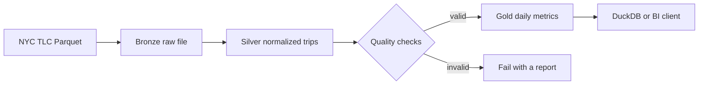

# NYC Taxi Lakehouse

This repository contains a small but complete batch pipeline for NYC taxi trip records. I built it as a local project first: it can run offline with a deterministic fixture, and it can also process a real TLC Parquet file when one is available.

The point of the project is not to pretend that a laptop is a distributed cluster. It is to keep the transformation rules, data checks, and output contract easy to inspect before moving the same ideas to Spark, Airflow, and a warehouse.

## Pipeline



## What is implemented

The command reads taxi records, normalizes timestamps, calculates trip duration, maps payment codes, rejects records that violate basic business rules, and writes two Parquet outputs. The gold table is grouped by trip date and payment method and contains trip count, revenue, average fare, average distance, average duration, total tips, and tip rate.

| Layer | Meaning | Local output |
| --- | --- | --- |
| Bronze | A copy of the input used for repeatable processing | `data/bronze/*.parquet` |
| Silver | Clean rows with a stable set of names and types | `data/silver/trips.parquet` |
| Gold | Aggregated data intended for analysis | `data/gold/daily_metrics.parquet` |

## Run it locally

```bash
python -m venv .venv
source .venv/bin/activate
pip install -e '.[dev]'
python -m src.pipeline --sample-rows 5000
pytest -q
ruff check .
```

The offline command is useful for tests and code review. To process a real file downloaded from the [NYC TLC Trip Record Data](https://www.nyc.gov/site/tlc/about/tlc-trip-record-data.page), run:

```bash
python -m src.pipeline --input data/incoming/yellow_tripdata_2024-01.parquet
```

The input file is intentionally not committed to the repository. Real TLC files are large, and the source page is the correct place to select the month required for an analysis.

## Incremental loading

Put one or more TLC Parquet files in `data/incoming/` and run:

```bash
python -m src.incremental \
  --input-dir data/incoming \
  --manifest data/state/manifest.json \
  --silver-dir data/silver \
  --gold-dir data/gold
```

The loader computes a SHA-256 fingerprint for each file. A successful file is recorded in the manifest and skipped on the next run. If a new month arrives, only that file is processed. If a file is replaced, its new fingerprint is treated as a new input. The manifest is updated after each successful file, so an interrupted run can resume without starting from zero.

## Airflow scheduling and backfill

The DAG is in `airflow/dags/nyc_taxi_monthly.py`. It is configured with a monthly schedule, `catchup=True`, two retries, and `max_active_runs=1`. Copy or mount this repository into the Airflow environment, place the target Parquet files under `data/incoming/`, then list the DAG:

```bash
airflow dags list | grep nyc_taxi_monthly_lakehouse
airflow dags test nyc_taxi_monthly_lakehouse 2024-01-01
```

For an explicit historical range, use Airflow backfill:

```bash
airflow dags backfill \
  --start-date 2024-01-01 \
  --end-date 2024-03-01 \
  nyc_taxi_monthly_lakehouse
```

The DAG does not download files automatically. Download the months you actually want from the official TLC page first, then let the manifest provide idempotency and safe reruns.

## Data checks

Rows are rejected when a required timestamp is missing, drop-off occurs before pickup, duration is longer than one day, distance is not positive, or total amount is smaller than fare amount. The test suite also checks that the aggregate trip count and revenue reconcile with the silver layer.

The current test run covers six cases and includes an end-to-end smoke run on 250 rows. It does not claim distributed performance; that is the next step once a real sample has been profiled.

## Repository layout

```text
src/
  generate_sample.py  # deterministic fixture for local tests
  pipeline.py         # command-line entry point
  quality.py          # quality report and fail-fast gate
  transform.py        # bronze -> silver -> gold
  incremental.py       # fingerprinted file-by-file processing
architecture/
  pipeline.mmd        # editable Mermaid diagram
airflow/
  dags/nyc_taxi_monthly.py
tests/
  test_pipeline.py
  test_incremental.py
```

## Next engineering steps

The next useful increment is a DuckDB SQL layer and a Spark implementation benchmarked against the local version. Those pieces should be added only after profiling a real TLC file, so the repository does not make performance claims without measurements.

## License

MIT
